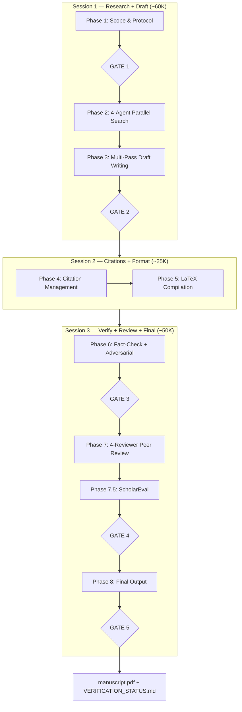
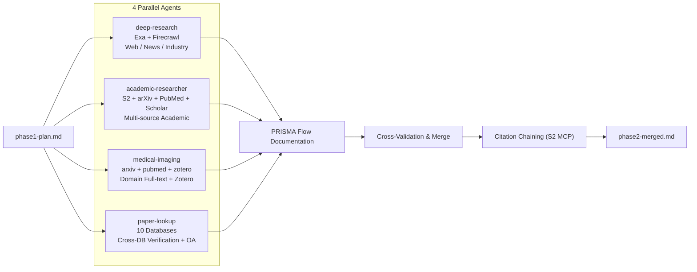
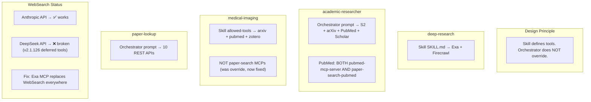
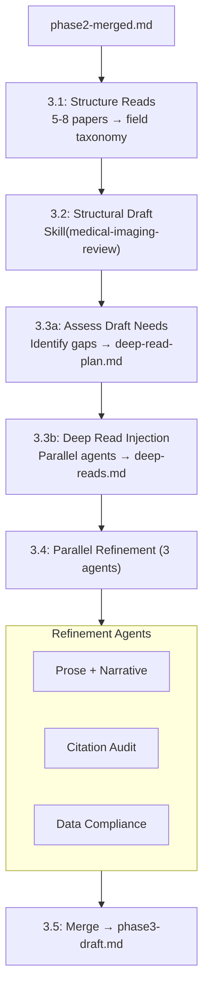
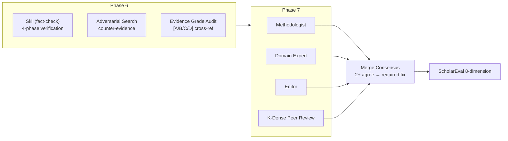

# Academic Orchestrator v6.3.0 — Architecture

## Pipeline Overview



## Phase 2: Parallel Research Detail



## MCP Tool Strategy (v6.3)



## Tool Choice Matrix

| Purpose | Primary | Fallback |
|---------|---------|----------|
| arXiv | `arxiv-mcp-server` | Semantic Scholar |
| PubMed | `pubmed-mcp-server` | `paper-search` PubMed |
| Google Scholar | `paper-search` | — (unique) |
| General Web | Exa MCP | Firecrawl (quota) |
| Semantic Academic | Semantic Scholar | Exa web search |

## Phase 3: Multi-Pass Writing



## Phase 6-7: Verification & Review



## Skill Dispatch Matrix

| Phase | Skill | Method |
|-------|-------|--------|
| 1 | literature-review | Skill + Agent |
| 2 | deep-research, academic-researcher, medical-imaging, paper-lookup | Agent (bg) x4 |
| 3.2 | medical-imaging-review | Skill (writing) |
| 3.4 | — | Agent (bg) x3 (prose, citation, data) |
| 4 | citation-management | Skill + orchestrator additions |
| 5 | latex-paper-en | Skill + Bash |
| 6 | fact-check + scientific-critical-thinking | Skill + orchestrator additions |
| 7 | peer-review (4 reviewers) | Agent (bg) x4 |
| 7.5 | scholar-evaluation | Skill |
| 8 | citation-management + writing-clearly-and-concisely | Skill + Agent (bg) |

## Bundled Skills

```
skills/
├── deep-research/          — Exa + Firecrawl web search
├── academic-researcher/    — Paper analysis methodology
├── medical-imaging-review/ — 7-phase medical imaging writing
├── citation-management/    — BibTeX + validation
├── fact-check/             — 4-phase verification
├── peer-review/            — Structured manuscript review
├── literature-review/      — Systematic review methodology
├── writing-clearly-and-concisely/ — Strunk language polish
└── latex-paper-en/         — LaTeX compilation + formatting
```

## Compatibility

| Model | WebSearch | MCP Tools | Notes |
|-------|-----------|-----------|-------|
| Anthropic (Claude) | ✅ | ✅ | Full native support |
| DeepSeek (v4-pro) | ❌ | ✅ | WebSearch replaced by Exa MCP |

## Installation

```bash
npx skills add ShijianRuan/academic-orchestrator -g -y
bash ~/.claude/skills/academic-orchestrator/INSTALL.sh
```

## External Skills (npx skills registry)

These skills are installed via `npx skills add` and stored in Claude Code's internal registry (NOT in `~/.claude/skills/`). They are available at runtime but SKILL.md files are not accessible for bundling.

| Skill | Source | Fallback if Missing |
|-------|--------|---------------------|
| paper-lookup | K-Dense-AI/scientific-agent-skills | Use MCP paper-search only |
| scientific-critical-thinking | K-Dense-AI/scientific-agent-skills | Skip; fact-check alone |
| scholar-evaluation | K-Dense-AI/scientific-agent-skills | Skip; qualitative reviews only |

Install:
```bash
npx skills add K-Dense-AI/scientific-agent-skills -g -y
```
