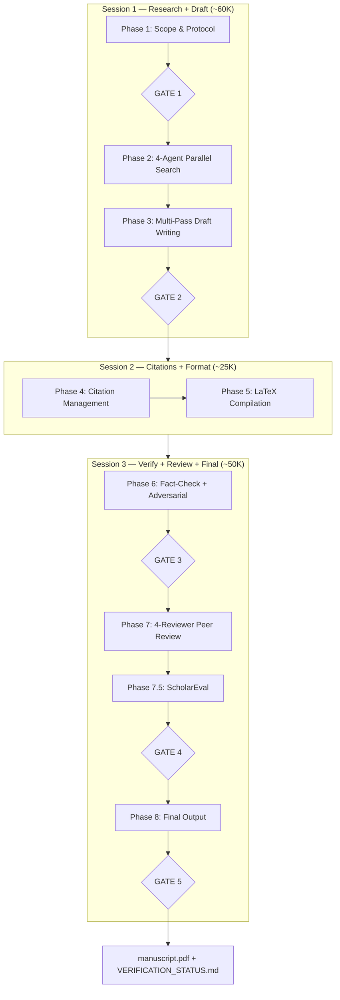
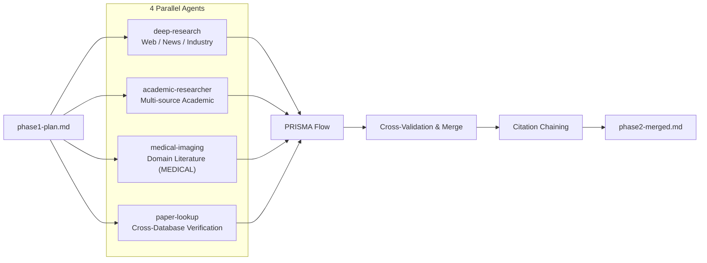
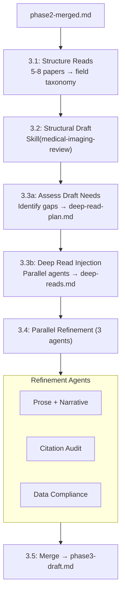
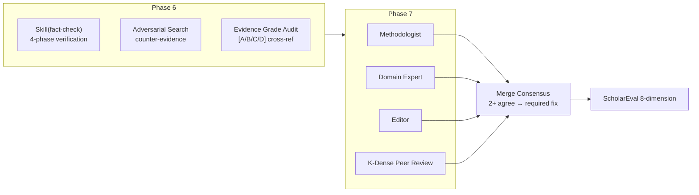

# Academic Orchestrator — Architecture

## Pipeline Overview



## Phase 2: Parallel Research



## MCP Tool Strategy

**Principle**: Each agent uses the tools defined by its own skill. The orchestrator provides search guidance but does not override tool choices.

| Agent | Tools Defined By | Primary Tools |
|-------|-----------------|---------------|
| deep-research | skill SKILL.md | Exa + Firecrawl |
| academic-researcher | orchestrator prompt | S2 + arXiv + PubMed + Scholar |
| medical-imaging | skill allowed-tools | arxiv + pubmed + zotero |
| paper-lookup | orchestrator prompt | 10-database REST APIs |

### Tool Choice Matrix

| Purpose | Primary | Fallback |
|---------|---------|----------|
| arXiv | `arxiv-mcp-server` | Semantic Scholar |
| PubMed | `pubmed-mcp-server` + `paper-search` PubMed | Exa web search |
| Google Scholar | `paper-search` | — (unique) |
| General Web | Exa MCP | Firecrawl |
| Semantic Academic | Semantic Scholar | Exa web search |

### Compatibility

| Model | WebSearch | MCP Tools |
|-------|-----------|-----------|
| Anthropic (Claude) | ✅ | ✅ |
| DeepSeek | ❌ (use Exa instead) | ✅ |

## Phase 3: Multi-Pass Writing



## Phase 6-7: Verification & Review



## Skill Dispatch Matrix

| Phase | Skill | Method |
|-------|-------|--------|
| 1 | literature-review | Skill + Agent |
| 2 | deep-research, academic-researcher, medical-imaging, paper-lookup | Agent (bg) x4 |
| 3.2 | medical-imaging-review | Skill |
| 3.4 | — | Agent (bg) x3 |
| 4 | citation-management | Skill |
| 5 | latex-paper-en | Skill |
| 6 | fact-check + scientific-critical-thinking | Skill |
| 7 | peer-review (4 reviewers) | Agent (bg) x4 |
| 7.5 | scholar-evaluation | Skill |
| 8 | citation-management + writing-clearly-and-concisely | Skill + Agent (bg) |

## Bundled Skills

```
skills/
├── deep-research/                 — Web search (Exa + Firecrawl)
├── academic-researcher/           — Paper analysis methodology
├── medical-imaging-review/        — 7-phase medical imaging writing
├── citation-management/           — BibTeX + validation
├── fact-check/                    — 4-phase verification
├── peer-review/                   — Structured manuscript review
├── literature-review/             — Systematic review methodology
├── writing-clearly-and-concisely/ — Language polish
├── latex-paper-en/                — LaTeX compilation
├── paper-lookup/                  — 10-database unified search
├── scientific-critical-thinking/  — Evidence grading + bias detection
└── scholar-evaluation/            — 8-dimension quantitative scoring
```

Skills 10-12 are from [K-Dense-AI/scientific-agent-skills](https://github.com/K-Dense-AI/scientific-agent-skills). They are bundled here for portability but can also be installed independently via `npx skills add K-Dense-AI/scientific-agent-skills -g -y`.
